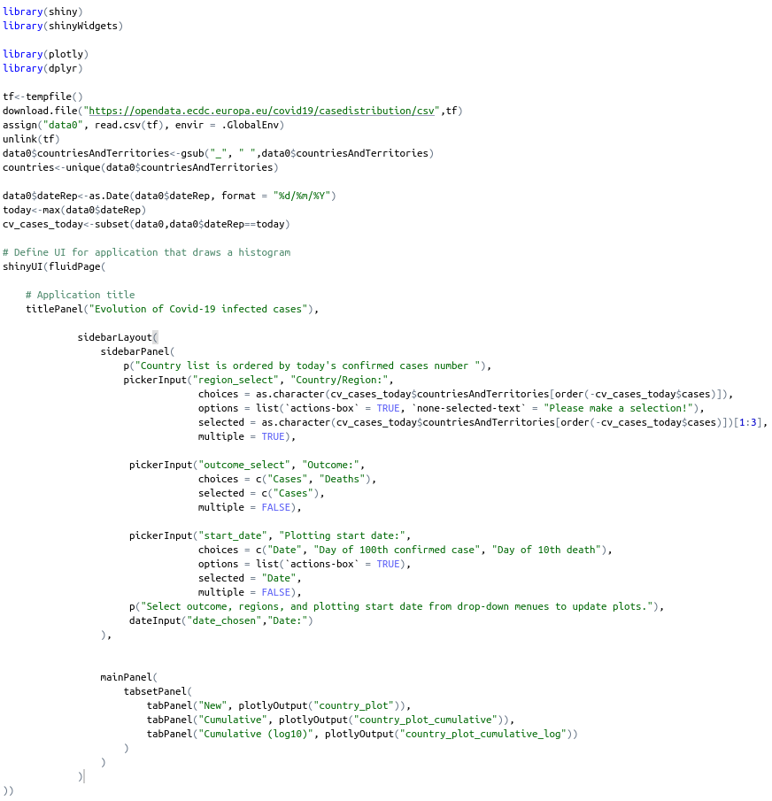
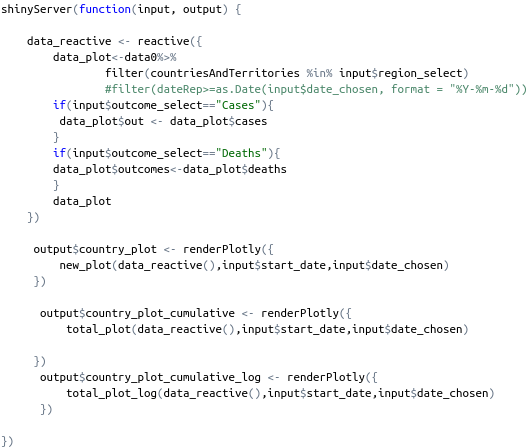

## Overview
This is an Shiny applications deveoloped as the final project in the Developing Data Products course. This application is a plotter for Evolution of Covid-19 infected cases in the world. The data used are from [Open Data of European Centre for Disease Prevention and Control](https://opendata.ecdc.europa.eu/covid19/casedistribution/csv).

The application includes: 
- Differents dropdown box to select the countries/regions, outcome type and, start date type.
- A date input box to select the date
  
This application is hosted at: https://limamaison.shinyapps.io/covid-19_plotter/
The source code is at: https://github.com/LiMAisae/ShinyApp

--- .class #id 

## Application widgets used

Widgets used in this App are listed below:

- pickerInput: This is the principal widget used in the application. Country/region field uses this to chose the countries/regions to be plotted in the figure. Outcome type should be infered by this and start date type field uses also this.

- date: This widget allows to get the date.

--- .class #id

## Operations inside the application and output

The outcome type controls the reactivity. Data are the processed to present the corresponding figures in accordance with the countries/regions selected and start date. 

Output:

- Daily new cases curve
- Cumulative cases curve
- Cumulative cases curve under logarithm scale

--- .class #id

## Application - ui.R

```{r, out.width = "600px",echo=FALSE}

```

--- .class #id

## Application - server.R

```{r, out.width = "550px",echo=FALSE}



